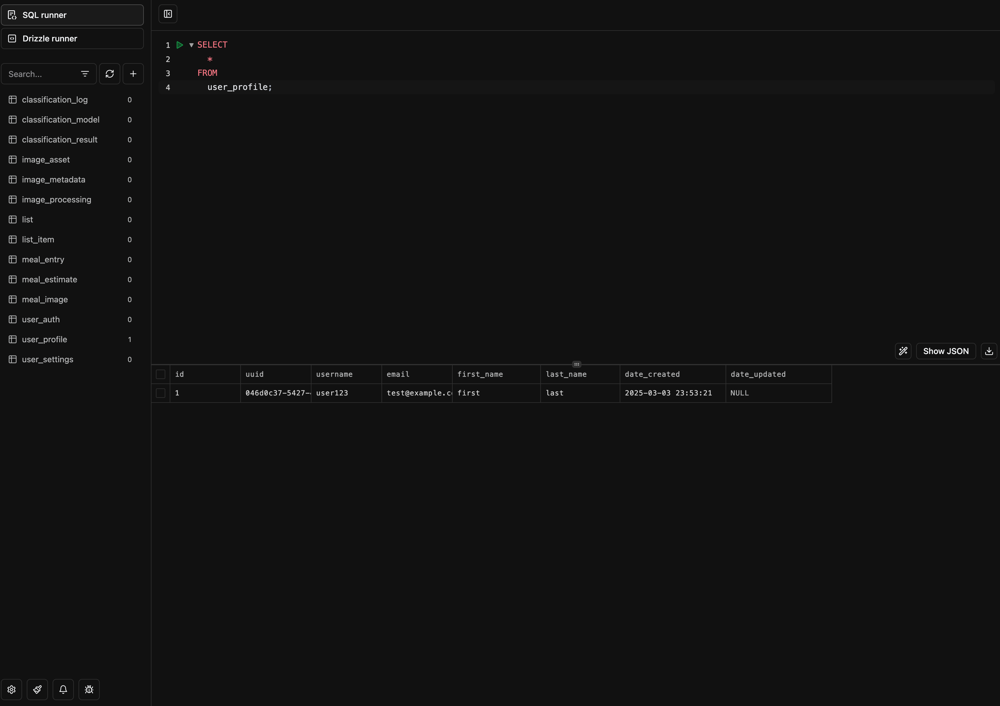

# Gibson Studio

This is a free, in-browser database manager and SQL editor that runs on your localhost using [Drizzle ORM](https://orm.drizzle.team/)'s Studio.



## Installation

### Clone this repo

```bash
git clone git@github.com:GibsonAI/studio.git
```

### Install the dependencies

```bash
npm install
```

### Set the connection string

Jump into your project settings in [Gibson](https://app.gibsonai.com/) and copy the connection string

Create a `.env` file with `DATABASE_URL=<your-connection-string>` (see `.env.example` for an example)

NOTE: you will need the `ssl={"rejectUnauthorized":false}` query param since this will be connecting from localhost without SSL enabled.

### Run the Studio

```bash
npm run studio
```

This will start the studio on <https://local.drizzle.studio>
